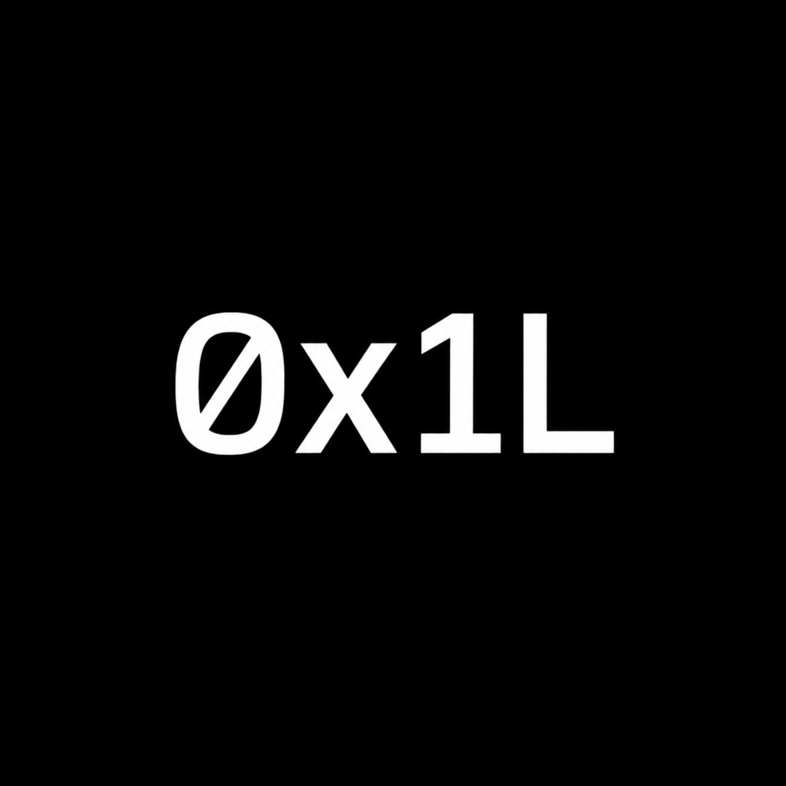
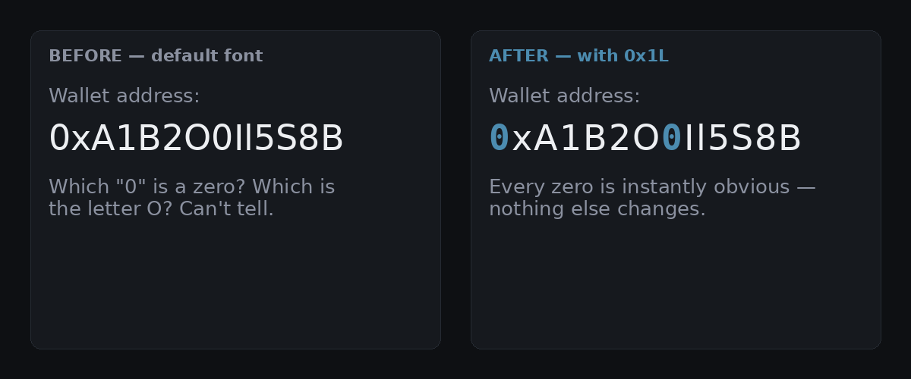

# 0x1L

**by glyphex**

**Never misread a `0` for an `O` again.**

`0x1L` is a lightweight browser extension that renders the digit `0` in a font with a
built-in dotted zero as you browse — so it's instantly distinct from the letter `O`. Nothing
else on the page is touched. It works on any website: Twitter/X, wallet explorers, GitHub,
Discord, anywhere text shows up.

Mockup for illustration — install the extension to see it live on real pages.

## Features

- **Zero configuration** — install it and it just works, no setup
- **Copy-paste safe** — only the font changes, never the character, so wallet addresses and
  codes always copy correctly
- **Works everywhere** — every website, automatically, no per-site setup
- **Genuinely lightweight** — no dependencies, no build step, no bundler, under 10 KB total

---

## Why

Crypto wallet addresses, invite codes, API keys, usernames — they're full of characters that
look nearly identical in most fonts. Misreading a `0` as an `O` in a wallet address doesn't
throw a friendly error; it just sends money to nowhere. `0x1L` makes the ambiguity visible at
a glance, without changing the underlying text at all.

## What it does

`0` is rendered in **JetBrains Mono**, a font whose zero glyph has a dot built directly into
its design — not a mark drawn on top, just a different, deliberate letterform for that one
character. `1`, `l`, `I`, and everything else render completely normally, in whatever font the
site already uses.

## Why it's safe on sensitive text

The character itself is never altered, only its font. Select and copy any `0` — from a wallet
address, a password, whatever — and you get back the exact original character. Nothing is
added, removed, or substituted. This was a deliberate design choice: a tool meant to help you
read addresses correctly would be worse than useless if it also risked corrupting what you
copy.

## Install

**Chrome Web Store:** submission in progress.

**Manual install (works today):**
1. Download this repository (`Code` → `Download ZIP`, or `git clone`).
2. Open `chrome://extensions` in Chrome, Brave, or Edge.
3. Turn on **Developer mode** (top right).
4. Click **Load unpacked** and select the extracted `0x1L` folder.
5. Refresh any open tab to see it in action.

## Usage

Click the `0x1L` icon in your toolbar to turn it on/off. Refresh open tabs after changing the
setting.

## How it works (for contributors)

- `content.js` walks the page's text nodes and wraps every `0` character in a small ``.
- `style.css` swaps that span's font to JetBrains Mono (falling back to other dotted-zero
  monospace fonts if it's unavailable), letting the font itself do the disambiguation.
- A `MutationObserver` watches for new content (infinite-scroll feeds, SPA navigation) and
  wraps zeros in it as it appears.
- `popup.html`/`popup.js` read and write the on/off setting via `chrome.storage.sync`.

No build step, no dependencies, no bundler — it's plain JS/CSS/HTML by design, so anyone can
read the entire extension in a few minutes.

## Roadmap

- [ ] Publish to the Chrome Web Store
- [ ] Firefox support (Manifest V2/V3 compatibility)
- [ ] Per-site enable/disable
- [ ] Desktop version (system-wide, not just browser)

## Contributing

Issues and pull requests are welcome — see [CONTRIBUTING.md](CONTRIBUTING.md) for setup and
where things live in the codebase.

## Support this project

If `0x1L` saved you from a typo, tips are appreciated but never expected:

**Solana:** `2w1EjwS9NsQ1k8BGdWLNZqzxVVuCTYvCNfn6n1TPJ4c7`

## About

`0x1L` is built and maintained by **glyphex**.

## License

MIT — see [LICENSE](LICENSE). Free to use, modify, and redistribute.
